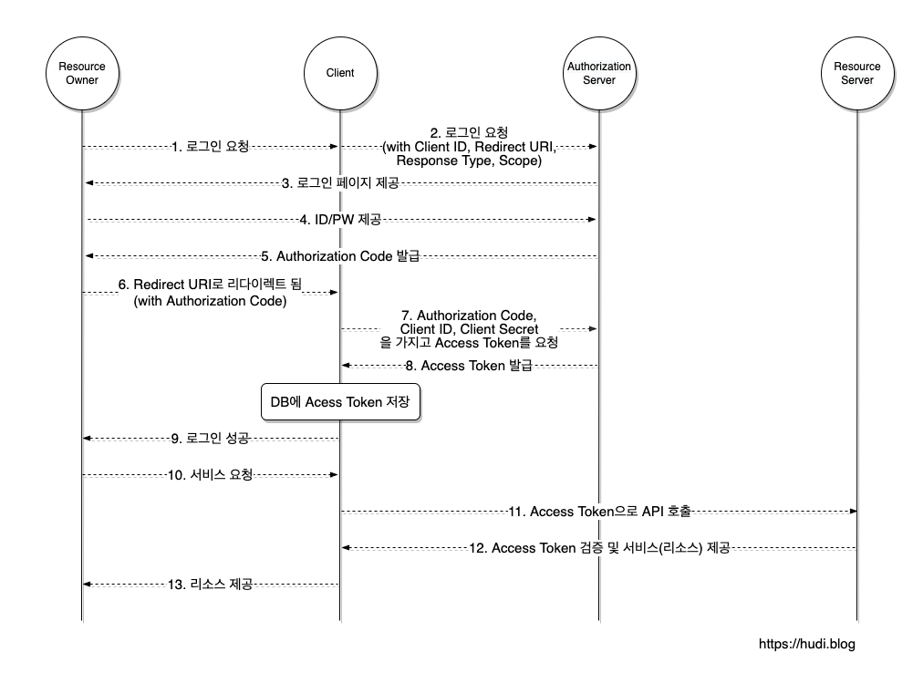

# OAuth란?
구글, 페이스북, 트위터와 같은 다양한 플랫폼의 특정한 사용자 데이터에 접근하기 위해 제3자 클라이언트가 사용자의 접근 권함을 위임받을 수 있는 표준 프로토콜    
-> 우리의 서비스가 우리 서비스를 이용하는 유저의 타사 플랫폼 정보에 접근하기 위해 권한을 타사 플랫폼으로 부터 위임 받는 것

## 1. 주체
### Resource Owner
리소스 소유자. 제3자 서비스를 이용 + 구글 등의 플랫폼 리소스를 소유하고 있는 사용자.
### Authorization & Resource Server
Authorization Server : Resource Owner를 인증하고 Client에게 엑세스 토큰을 발급해주는 서버   
Resource Server : 구글, 페이스북, 트위터와 같은 리소스를 가진 서버
### Client
Resource Server의 자원을 이용하고자 하는 서비스

## 2. 과정

### 2-0. 어플리케이션 등록
Client를 Resource Server에 등록하는 작업이 필요함   
이때 **Redirect URI 를 등록**하여야 함    
Redirect URI 는 **사용자가 OAuth 2.0 서비스에서 인증을 마치고 사용자를 리다렉션 시킬 위치**     
등록을 마치면 **Client ID, Client Secret 을 얻을 수 있음**, 이는 절대 유출 되면 안됨

### 2-1. 매커니즘


#### 1~2. 로그인 요청
Resource Owner가 우리 서비스의 '구글로 로그인하기' 등의 버튼을 클릭해 로그인 요청   
Client는 OAuth 프로세스를 시작하기 위해 사용자의 브라우저를 Authorization Server 로 보내야함  
클라이언트는 이 때 Authorization Server가 제공하는 URL에 response_type, client_id, redirect_uri, scope 등의 매개변수를 쿼리스트링으로 포함하여 보냄   
```
https://authorization-server.com/auth?response_type=code
&client_id=29352735982374239857
&redirect_uri=https://example-app.com/callback
&scope=create+delete
```

#### 3~4. 로그인 페이지 제공, ID/PW 제공
클라이언트가 빌드한 Authorization URL로 이동된 Resource Owner는 제공된 로그인 페이지에서 ID, PW 입력

#### 5~6. Authorization Code 발급, Redirect URI로 리디렉션
인증이 성공되면 Authorization Server는 제공된 Redirect URI로 리디렉션 시킴    
이때 Redirect URI에 Authorization Code를 포함하여 사용자를 리디렉션 시킴

#### 7~8. Authorization Code 와 Access Token 교환
Authorization Server 에 Authorization Code를 전달하여 Access Token 받음
Client는 Resource Owner의 Access Token 을 저장하고, 이후 Resource Server에서 Resource Owner의 리소스에 접근하기 위해 Access Token 을 사용함
```
POST /oauth/token HTTP/1.1
Host: authorization-server.com

grant_type=authorization_code
&code=xxxxxxxxxxx
&redirect_uri=https://example-app.com/redirect
&client_id=xxxxxxxxxx
&client_secret=xxxxxxxxxx
```

#### 9. 로그인 성공
Client 는 Resource Owner에게 로그인이 성공했음을 알림

#### 10~13. Access Token 으로 리소스 접근
Resource Owner 가 Resource Server의 리소스가 필요한 기능을 Client에 요청   
Client는 위의 과정에서 발급받고 저장 해둔 Resource Owner의 Access Token 을 이용해 제한된 리소스에 접근   
Resource Owner 에게 자사의 서비스 제공

### Q. Authorization Code 가 왜 필요?
Redirect URI 를 통하여 정보를 전달할 수 있는 방법은 쿼리 스트링 뿐이다  
쿼리스트링에 토큰이 들어가면 브라우저를 통해 데이터가 곧바로 노출 된다     
토큰은 민감한 데이터 이므로, Authorization Code를 사용한다   
Redirect URI를 프론트 주소로 설정 - Authorization Code를 프론트엔드로 전달 - Authorization Code 는 프론트를 통해 백엔드로 전달 - 코드를 받은 백엔드는 이를 통해 토큰을 발급  
이렇게 진행하게 되면 Access Token 이 항상 우리의 어플리케이션과 OAuth 서비스 백채널을 통해 전송되어 토큰을 가로챌 수 없다       

[reference]     
https://hudi.blog/oauth-2.0/

