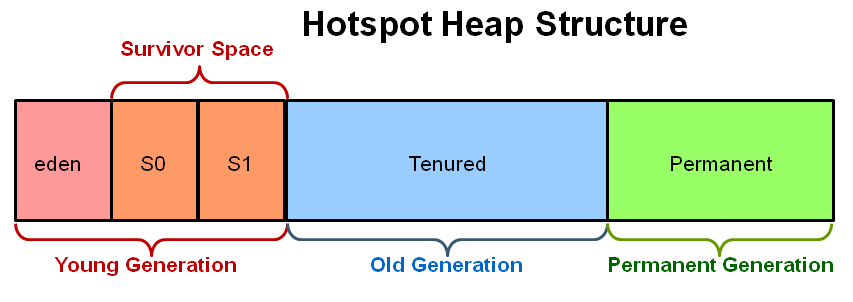

# 가비지 컬렉션이란?

프로그램 개발 중에 사용하지 않는 객체의 메모리, 가비지 발생     
JAVA, 코틀린에서는 JVM의 가비지 컬렉터(GC)가 불필요한 메모리를 정리해줌   
사용하지 않는 객체의 메모리 점유 -> 메모리 누수로 이어짐, 이를 방지 위함

## 1. 가비지 컬렉터, 가비지 컬렉션
- 가비지 컬렉터 : 메모리를 관리하는 담당 시스템, 프로그램의 구성요소. 메모리에서 더 이상 사용되지 않는 객체를 찾아 제거하여 메모리를 회수하는 역할
- 카비지 컬렉션 : 메모리 관리 기술 중 하나, 가비지 컬렉터에 의해 수행되는 프로세스
- 가비지 컬렉션은 프로세스 자체, 컬렉터는 실행하는 주체

## 2. JVM 힙 메모리 영역

### 2-1. Young Generation (Young 영역)
- 새롭게 생성된 객체가 할당(Allocate) 되는 영역
- 금방 Unreachable 상태가 되므로, 많은 객체가 여길 거쳐감
- Young 영역에 대한 가비지 컬렉션을 **Minor GC** 라고 함

### 2-2. Old Generation (Old 영역)
- Young 영역에서 Reachable 상태를 유지해 살아남은 객체가 복사되는 영역
- Young 영역보다 크게 할당되며, 영역의 크기가 큰 만큼 가비지는 적게 발생
- Old 영역에 대한 가비지 컬렉션을 **Major GC, Full GC** 라고 함

### 2-3. Permanent Generation (Perm 영역)
- JVM에서 클래스 메타데이터(클래스와 메소드, 필드 등 정보)를 저장하는 곳
- 클래스 로더는 클래스 파일을 읽어들여서 이 영역에 클래스 메타데이터 저장
- 이 정보들은 JVM 실행 도중에 변경되지 않으며, JVM 종료시 까지 유지

### 2-4. 자바 8 이후 Perm 영역은 Metadata Space 로 변경
- Metadata space
  - Perm 영역에서 저장하던 Class Meta 정보 저장
  - Native Memory 영역에 위치, JVM이 아닌 OS 레벨에서 관리
  - 클래스 메타 데이터, 리플랙션 사용하는 애플리케이션에서 사용하는 일부 메모리 저장
- 왜 대체?
  - Perm 영역의 메모리 누수, OutOfMemoryError 등의 문제
  - 클래스 메타 데이터를 Native Memory 에 저장하며 JVM에서의 OutOfMemoryError 문제 해결

## 3. Reachable 과 Unreachable
자바 GC는 객체가 가비지인지 판별하기 위해 Reachability 라는 개념 사용      
어떤 객체에 유효한 참조가 있으면 **'Reachable'**, 없으면 **'Unreachable'**   
Unreachable 일 경우 가비지로 간주 해 GC 수행

## 4. 과정
1. Marking
   - 가비지 컬렉터는 메모리에서 live object 확인, unreachable object 뭔지 마킹
2. Normal Deletion
   - 가비지 컬렉터는 unreachable object 삭제
3. Deletion with Compacting
   - 가비지 컬렉터 중 일부는 메모리를 더욱 효과적으로 쓰기 위해 unreachable object를 삭제함과 동시에 압축을 진행

[reference]
https://velog.io/@yarogono/Java%EA%B0%80%EB%B9%84%EC%A7%80-%EC%BB%AC%EB%A0%89%ED%84%B0Garbage-Collector%EB%9E%80
https://meoru-tech.tistory.com/81