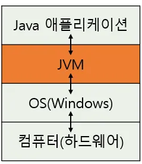
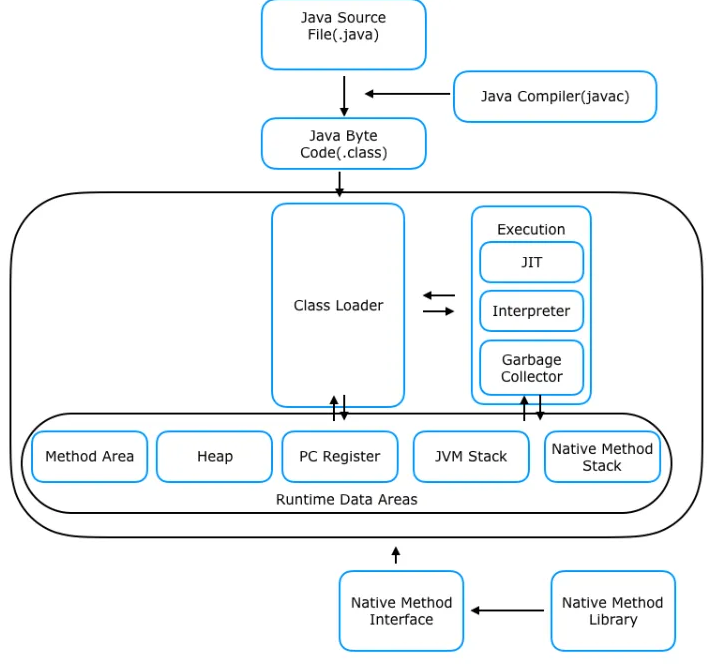
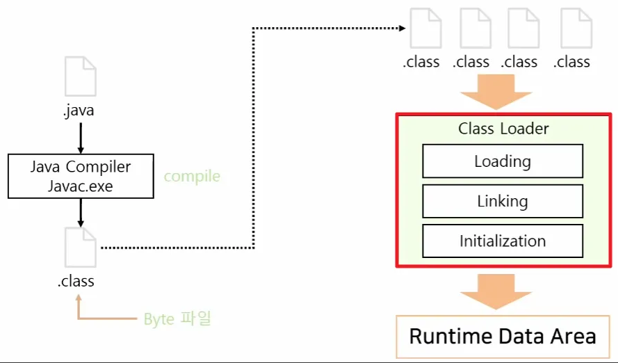
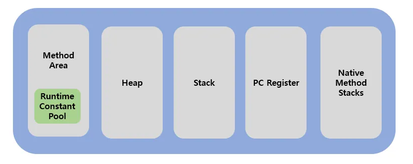
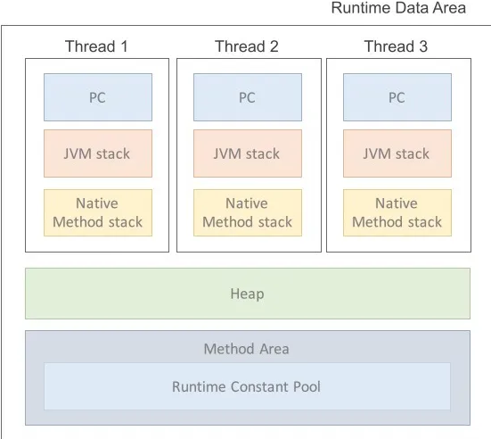
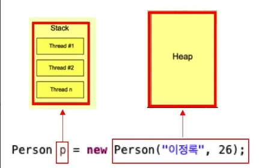

# JVM

Q. JVM에 대해 설명해주세요  
A. JVM은 Java Virtual Machine으로 자바를 실행하기 위한 가상머신으로, 자바가 OS에 구애받지 않고 실행이 가능하도록 합니다. JVM은 크게 클래스 로더, 실해 엔진, 런타임 메소드 에리아로 구성이 되어 있습니다. 

## JVM 이란?
Java Virtual Machine으로 자바를 실행하기 위한 가상 기계이다.
자바 바이트코드(.class 파일)를 OS에 특화된 코드로 변환하여 실행한다.
OS가 달라지더라도 프로그램의 변경 없이 실행이 가능해짐. 

## JVM에 구성요소  

크게 class Loader, 실행 엔진, Runtime Data 영역 으로 이루어져 있다.  

### 클래스 로더
클래스 로더는 런타임 중에 JVM의 메소드 영역에 동적으로 Java 클래스(.class)를 로드하는 역할을 한다  

자바의 경우 컴파일 타임이 아니라, 런타임에 클래스를 로드하는 동적 로딩 특징을 가졌다.  

### 런타임 데이터 영역  
JVM의 메모리 영역으로 자바 애플리케이션을 실행할 때 사용되는 데이터들을 적재하는 영역이다.  

이때 Method Area, Heap Area는 모든 스레드가 공유하는 영역이고  
stack, pc register, native Method Stack은 각 스레드가 개별로 가지고 있다.  
  

1. 메서드 영역
- JVM이 시작될 때 생성되는 공간으로 JVM이 읽어 들인 각각의 클래스와 인터페이스에 대한 메타데이터 정보를 저장한다.
- 모든 스레드에서 공유함

- 메타 데이터 종류   
    - 클래스 이름
    - 필드 정보
    - 메서드 정보 : 매서드 이름, 반환 타입, 매개변수 목록 등..
    - 메서드 바이트코드  

2. 힙 영역  
- JVM이 관리하는 프로그램 상에서 데이터를 저장하기 위해 런타임 시 동적으로 할당하여 사용하는 영역

    ⇒  new 연산자로 생성된 객체와 배열이 생성되는 영역이다.  

3. 스택 영역
메서드 호출 시 지역 변수, 매개변수, 함수 호출내역 등이 저장되는 영역  
- 메서드 호출시마다 각각 스택 프레임이 생성되고, 메서드 안에서 사용하는 값들을 저장함
- 호출된 메서드의 매개변수, 지역변수, 리턴값 및 연산이 일어나는 값들을 임시로 저장한다.

팁!  Stack과 힙에 각각 누가 저장될까 ? 

- new 에 의해 생성된 클래스는 Heap Area 에 저장됨
- Stack Area 에는 생성된 클래스의 참조인 p 만 저장된다.  

4. PC 레지스터
PC 레지스터는 스레드가 시작될 때 생성됨
현재 수행중인 JVM 명령어 주소를 저장하는 공간  

5. Native Method Stack
자바 외의 언어로 작성된 네이티브 코드를 위한 스택  
Java Native Interface를 통해 호출하는 C/C++코드를 수행하기 위한 부분

### 실행 엔진  

클래스 로더를 통해 런타임 데이터 영역에 배치된 바이트 코드를 명령어 단위로 읽어서 실행한다

자바 바이트 코드(*.class)는 기계가 바로 수행할 수 있는 언어보다는 가상머신이 이해할 수 있는 중간 레벨로 컴파일 된 코드이다. 그래서 실행 엔진은 이와 같은 바이트 코드를 실제로 JVM 내부에서 기계가 실행할 수 있는 형태로 변경해준다.
 
이 과정에서 실행 엔진은 인터프리터와 JIT 컴파일러 두 가지 방식을 혼합하여 바이트 코드를 실행

1. 인터프리터
- 바이트코드 명령어를 하나씩 읽어서 해석하고 바로 실행
- JVM 안에서 바이트코드는 기본적으로 인터프리터 방식으로 동작
- 같은 메소드라도 여러번 호출되면 매번 해석하고 수행해야 해 전체적인 속도가 느림

2. JIT 컴파일러 (Just In Time Compiler)
- 인터프리터의 단점을 보완하기 위해 도입
- 반복되는 바이트코드 전체를 컴파일해 Native Code로 변경해 캐싱해 두고, 나중에 필요할 때 네이티브 코드를 바로 실행하는 방식  

-> 컴파일 과정은 인터프리터보다 오래 걸리므로, 한번 실행하는 코드의 경우 인터프리팅이 유리  
따라서 JVM은 내부적으로 해당 메서드가 얼마나 자주 수행되는지 체크하고 일정 정도를 넘을 때만 컴파일을 수행함  

