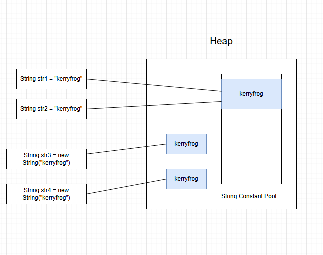
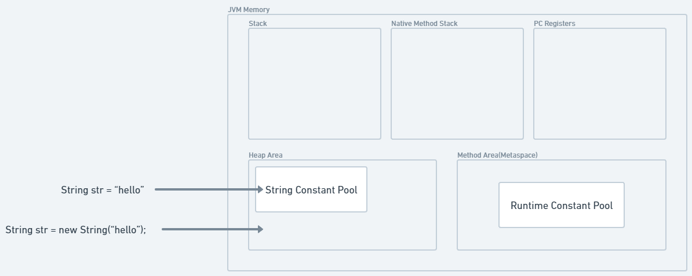

# new String()과 리터럴("")의 차이점

## 면접
Q. new String()과 리터럴("")의 차이에 대해 설명해주세요.

A. 
String을 통해 생성된 객체는 JVM내의 Heap영역에 저장이 됩니다.  
""를 통해 리터럴로 생성된 객체의 경우 JVM Heap 영역에 String Constant Pool 내에 저장되게 됩니다. 


## 생성과 비교

```
public void string() {
    // 문자열 리터럴 생성
    String str1 = "kerryfrog"; 
    String str2 = "kerryfrog";
    // new 연산자를 이용한 문자열 생성
    String str3 = new String("kerryfrog"); 
    String str4 = new String("kerryfrog"); 

    System.out.println(str1 == str2);	// true (같은 객체를 재사용하기 때문에)
    System.out.println(str1 == str3);	    // false
    System.out.println(str1.equals(str3));	// true
}
``` 




## 주의할 점 

String Constant Pool 은 JVM의 Method Area의 Runtime Constant Pool과는 다른 영역이다


