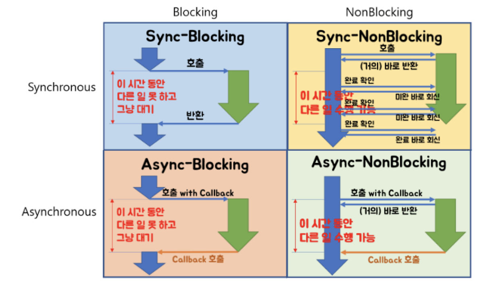

# Blocking / Non-blocking , Synchronous/Asynchronous

## Blocking / Non-blocking

호출된 함수가, 호출한 함수에게 제어권을 건내주는 유무의 차이  
Blocking의 경우 호출된 함수가 할일을 마칠때까지 계속 제어권을 가지고 있다.  
Non-blocking의 경우 호출된 함수가 호출한 함수에게 제어권을 바로 넘겨준다.   

EX) 함수 A,B가 있고, A에서 B를 호출했다. 현재 B가 호출되며 B는 자신의 일을 진행해야 한다.(제어권이 B에게 주어짐)  
호출한 함수 : A  
호출된 함수 : B

Blocking: 함수 B는 할일을 마칠 때 까지 제어권을 가지고 있는다. A는 B가 다 마칠 때 까지 기다려야 한다.
Non-blocking: 함수 B는 할 일을 마치지 않았어도 A에게 제어권을 바로 넘겨준다. A는 B를 기다리면서 다른 일을 할 수 있다. 

## Synchronous(동기)/Asynchronous(비동기)
동기/비동기는 일을 수행중인 **동시성**에 주목한다.
아까 함수 A와 B라고 생각했을 때, B의 수행 결과나 종료 상태를 A가 신경쓰는지의 유무의 차이다.

Synchronous(동기): 함수 A는 함수 B가 일을 하는 중에 기다리면서 현재 상태가 어떤지 계속 체크한다.   
Asynchronous(비동기): 함수 B는 수행 상태를 B혼자 직접 처리한다.   

즉 호출된 함수 B의 수행 상태를 호출한 함수가 신경쓰는지, 호출된 함수 자신이 신경쓰는지를 동기 비동기라고 한다.  

