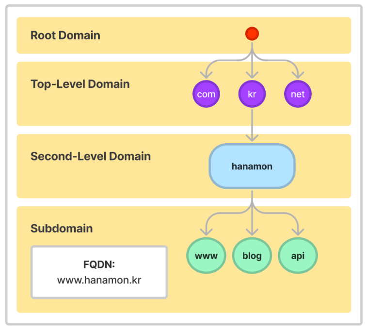
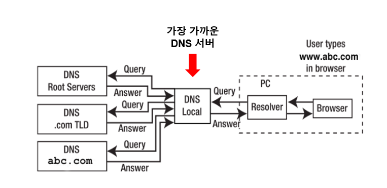

# DNS란 ?
DNS는 Domain Name System으로 도메인 네임을 IP 주소로 변환해주는 전체 시스템을 이르는 말 이다.   

DNS는 상위 기관과 하위 기관과 같은 계층 구조를 갖는 분산 데이터베이스 구조를 가진다.  

## DNS 구성요소 
- 도메인 네임 스페이스(Domain Name Space)
- 네임 서버(Name Server)
- 리졸버(Resolver)

### 도메인 네임 스페이스
DNS가 저장, 관리하는 계층적 구조  

도메인 네임 스페이스는 일반적으로 트리 구조를 하고 있으며 최상위 레벨부터 순차적으로 계층적 소속 관계를 나타낸다.  

예를들어 hanamon.kr 도메인의 경우 kr을 관리하는 도메인 네임 서버에 등록되어 있고, www.hanamon.kr은 hanamon.kr을 관리하는 네임서버에 등록되어 관리된다.  

## 네임서버
문자열로 표현된 도메인 이름을 실제 컴퓨터가 통신할 때 사용하는 IP주소로 변환시키기 위한 정보를 가지고 있는 서버  

따라서 데이터베이스 역할, 찾아주는 역할, 요청 처리 응답 구현의 역할을 한다.  

## 리솔버
사용자의 컴퓨터나 네트워크에 위치한 DNS 클라이언트  

## DNS의 동작

1. 사용자가 웹 브라우저에서 도메인 이름을 입력한다.

2. DNS Resolver는 자신의 캐시에 해당 도메인 이름에 대한 IP 주소가 저장되었는지 확인한다. 있는경우 바로 IP주소를 반환하고, 없는경우 DNS 서버에 요청하게 된다.

3. DNS Resolver는 재귀적 질의를 통해 IP 주소를 얻어온다. 
로컬 DNS가 루트 DNS에게 IP주소를 물어봤는데 없으면 TLD DNS에게 물어보고 또 없으면 authoriative DNS에 반복적으로 물어본다. 

4. DNS Resolver는 이제 해당 IP 주소를 캐시에 저장하고, 이후 동일한 도메인 이름에 대한 질의가 들어올 때 캐시에 저장된 IP 주소를 사용한다.

5. DNS Resolver는 IP주소를 찾아서 브라우저에 보내고, 브라우저는 IP주소를 통해 서버에 요청을 보낸다.

