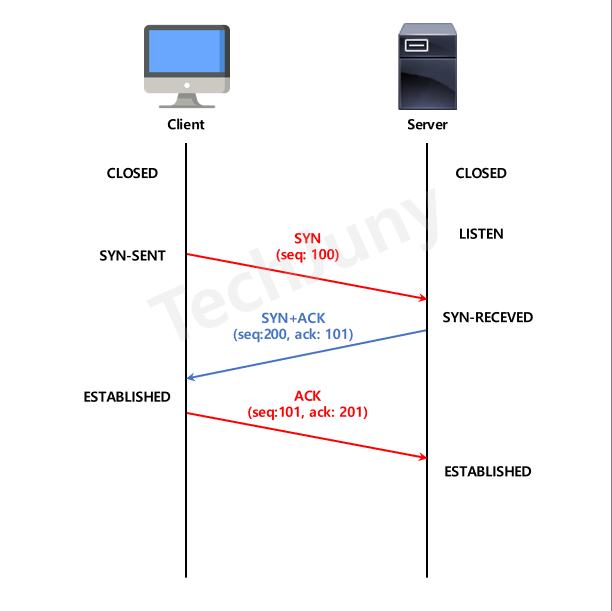
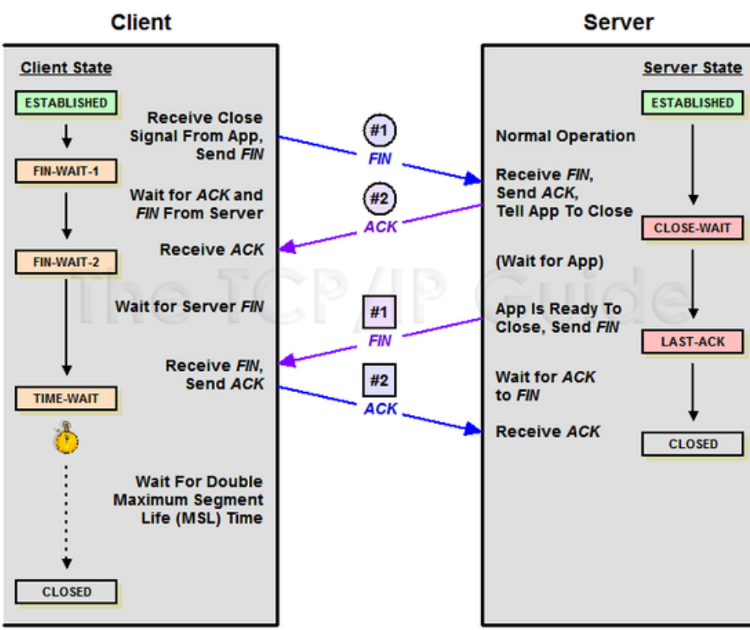

# TCP란?

인터넷 상에서 데이터를 메시지의 형태로 보내기 위해 IP와 함께 사용하는 프로토콜   
TCP는 애플리케이션에게 신뢰적, 연결지향성

## 1.TCP 3-way Handshake
TCP 프로토콜로 통신하기 위해 데이터 전송 전 상호 연결 과정     
데이터 전송할 준비가 되었다는 것을 보장, 데이터 전송 준비   
이때 정상적으로 세션이 맺어지지 않으면 통신 중단

### 1-1. 과정

1. Client -> SYN -> Server
   - Client 가 Sever에게 연결 요청 플래그
2. Server -> SYN + ACK -> Client
   - Server는 Listen 상태에서 SYN 들어온 것 확인 후 SYN_RECV 상태로 변경
   - SYN + ACK 플래그를 Client에게 전송
   - Server는 다시 대기 상태로 변경
3. Client -> ACK -> Server
   - SYN + ACK 상태를 확인한 Client는 Server에게 ACK 전송
   - 연결 성립(Established) 됨

### 1-2. 자세하게

1. Closed
   - 아직 연결 시도 전, Client와 Server 의 상태
   - TCP 포트 닫혀있음
2. Listen
   - TCP 포트 열고 기다림
   - 연결 요청 대기 상태
3. Syn-Sent
   - Client가 Server에게 연결을 요청하는 SYN 패킷 전송
   - 임의 값 seq(100) 넘버 함께 전송
4. Syn-Received
   - SYN 패킷을 받은 Server는 요청 수락, SYN+ACK 패킷 전송
   - 임의 값 **seq(200) 넘버 전달**
   - 해당 패킷의 응답이라는 표시로 Client에게 받은 seq(100) + 1 = **ack(101) 넘버 전달**
5. Established(client)
   - Server로부터 SYN+ACK 응답 받아 **client는 연결 수립상태**
   - 다시 Server 에게로 ACK 수립 완료 패킷 전달
   - 전에 보낸 seq(100) + 1 = **seq(101) 전달**
   - 해당 패킷의 응답이라는 표시로 Server로 부터 받은 seq(200) + 1 = **ack(201) 넘버 전달**
6. Established(server)
   - Client로 부터 연결이 수립되었다는 ACK 패킷을 전달 받아 **Sever도 연결 수립상태**
   - Sever와 Client 모두 Establish 모드가 된 후 데이터 송수신 이뤄짐

## 2. TCP 4-way Handshake

3 way handshake가 연결 확립을 위해 진행되었다면 4 way handshake는 세션을 종료하기 위해 수행되는 절차

### 2-1. 과정
1. Client -> FIN -> Server
   - Client 가 연결을 종료하겠다는 **FIN 플래그를 Server에게 전송**
   - 보낸 후 Client 는 **FIN-WAIT-1 상태로 변함**
2. Server -> ACK -> Client
   - FIN 플래그를 받은 Server는 확인 메세지인 **ACK 를 Client에게 전송**
   - **Server 는 CLOSE-WAIT** 상태, **Client 는 FIN-WAIT-2** 상태로 변함
3. Server -> FIN -> Client
   - Close 준비가 다 된 후 Server 가 **Client 에게 FIN 플래그 전송**
4. Client -> ACK -> Server
   - Client 해지 준비가 되었다는 정상 응답인 **ACK를 Server에게 전송**
   - **Client 는 TIME-WAIT** 상태로 변함

## 3. 정리

### Q1. TCP 연결 설정 과정(3way)과 연결 종료 과정(4way) 단계 차이가 나는 이유?
- 클라이언트가 데이터 전송을 마쳤다 하더라도 서버는 아직 보낼 데이터가 남아있을 수 있기 때문에 일단 FIN에 대한 ACK만 보내고, 데이터를 모두 전송한 후에 자신도 FIN 메시지를 보내기 때문

### Q2. 만약 서버에서 FIN 플래그를 전송하기 전 전송한 패킷이 Routing 지연/패킷 유실로 인한 재전송으로 인해 FIN 패킷 보다 늦게 도착하면?
- 위에서 4way handshake 과정 마지막 부분에서 말한 TIME-WAIT 부분이 답. TCP는 이러한 현상에 대비해 클라이언트는 FIN 플래그를 수신하더라도 일정시간동안 세션을 남겨놓고, 잉여 패킷을 기다림

### Q3. 초기 Sequence Number 인 ISN을 0부터 시작하지 않고 난수를 생성해서 설정하는 이유?
- Connection을 맺을 때 사용하는 포트는 유한 범위 내에서 사용하고, 시간이 지남에 따라 재사용 됨. 따라서 두 통신 호스트가 과거에 사용된 포트 번호 쌍을 사용하는 가능성 존재함. 서버 측에서는 패킷의 SYN을 보고 패킷을 구분하게 되는데 난수가 아닌 순차 Number 를 전송하게 된다면 이전 Connection으로 부터 오는 패킷으로 인식가능. 이러한 문제 발생가능성을 줄이기 위해 난수로 ISN 설정.

[reference] https://jeongkyun-it.tistory.com/180