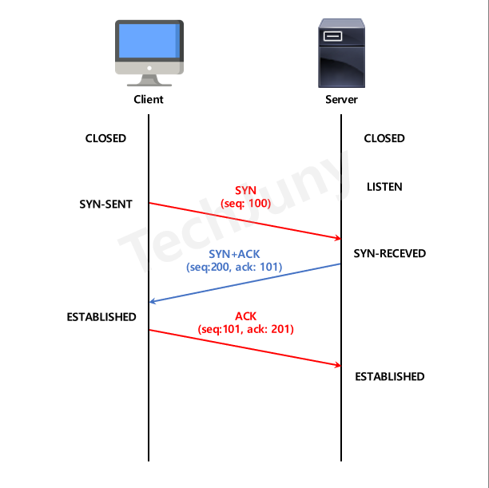

# TCP 3-way Handshake
TCP 프로토콜로 통신하기 위해 데이터 전송 전 상호 연결 과정     
데이터 전송할 준비가 되었다는 것을 보장, 데이터 전송 준비   
이때 정상적으로 세션이 맺어지지 않으면 통신 중단

## 1. 과정

1. Closed
   - 아직 연결 시도 전, Client와 Server 의 상태
   - TCP 포트 닫혀있음
2. Listen
   - TCP 포트 열고 기다림
   - 연결 요청 대기 상태
3. Syn-Sent
   - Client가 Server에게 연결을 요청하는 SYN 패킷 전송
   - 임의 값 seq(100) 넘버 함께 전송
4. Syn-Received
   - SYN 패킷을 받은 Server는 요청 수락, SYN+ACK 패킷 전송
   - 임의 값 **seq(200) 넘버 전달**
   - 해당 패킷의 응답이라는 표시로 Client에게 받은 seq(100) + 1 = **ack(101) 넘버 전달**
5. Established(client)
   - Server로부터 SYN+ACK 응답 받아 **client는 연결 수립상태**
   - 다시 Server 에게로 ACK 수립 완료 패킷 전달
   - 전에 보낸 seq(100) + 1 = **seq(101) 전달**
   - 해당 패킷의 응답이라는 표시로 Server로 부터 받은 seq(200) + 1 = **ack(201) 넘버 전달**
6. Established(server)
   - Client로 부터 연결이 수립되었다는 ACK 패킷을 전달 받아 **Sever도 연결 수립상태**
   - Sever와 Client 모두 Establish 모드가 된 후 데이터 송수신 이뤄짐