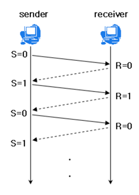
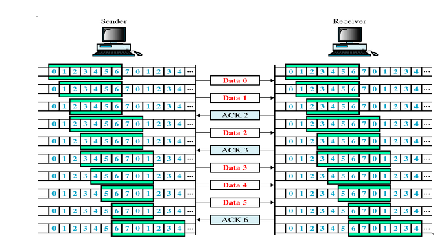
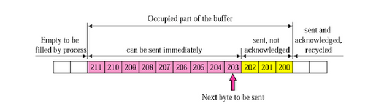
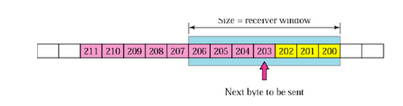
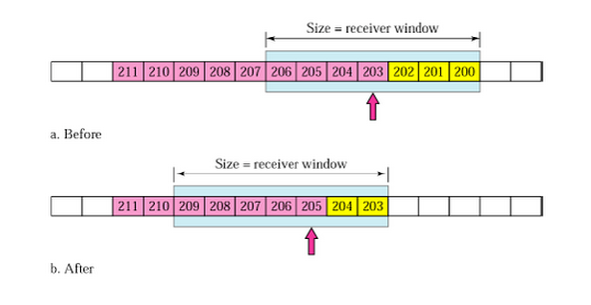

## TCP의 특징
TCP는 패킷 교환 방식으로 네트워크에서 패킷들이 안전하게 이동할 수 있도록 보장해주는 프로토콜이다. 크게 흐름제어, 혼잡제어 동작을 수행한다.

## 흐름제어란 ?
송신측과 수신측의 데이터 처리 속도 차이를 해결하기 위한 기법이다.  
수신측이 packet을 지나치게 많이 받지 않도록 조절해야 한다.  
이를 위해서 수신측이 송신측에게 자신의 상태를 계속해서 알려야 한다.  

## 흐름제어 알고리즘 

### Stop And Wait
매번 전송한 패킷에 대해 확인 응답을 받아야만 그 다음 패킷을 전송하는 기법이다.

### Sliding Window(Go-Back-n ARQ)
수신측에서 설정한 윈도우 크기만큼 송신측에서 패킷 각각에 대한 확인 응답없이 세그먼트를 전송하게 하고, 데이터 흐름을 동적으로 조절하는 기법  

TCP/IP 를 사용하는 모든 호스트들은 송신 그리고 수신을 위한 2개의 Window 를 가지고 있다. 호스트들은 실제 데이터를 보내기 전에 3-Way Handshake 를 통해 연결 설정을 해줄 때 수신 호스트의 Receive Window 크기에 자신의 Send Window 크기를 맞춰 설정한다.  

**슬라이딩 윈도우 예시**

1. 송신 버퍼 현재 상태 확인

    

    - 200 이전 바이트까지 전송 완료 후, ack 받음
    - 200~ 202 바이트는 전송했으나, ack 못받음 
    - 203~211 바이트는 아직 전송하지 않음

2. 수신 윈도우와 송신 윈도우의 크기

    수신 윈도우
    
    송신 윈도우
    

    송신 윈도우는 수신 윈도우보다 작거나 같은 크기로 지정하여 흐름을 제어한다.  

3. 슬라이딩 윈도우 이동
    

    - Before에서 송신 버퍼 내에 있는 203~204를 전송한다.  
    - 수신에서 203에 대한 확인 응답을 보낸다.  
    - 송신측에서는 이 값을 확인하고 송신 윈도우를 203~209로 이동한다.  
