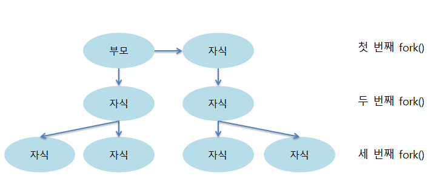

# 멀티 프로세스와 멀티 스레드
- 프로세스 : 운영체제로부터 자원을 할당받는 **작업의 단위**
- 스레드 : 프로세스가 할당받은 자원을 이용하는 **실행의 단위**

## 1. 멀티 프로세스와 멀티 스레드

### 1-1. 멀티 프로세스 
#### 개념
- 운영체제에서 하나의 응용 프로그램에 대해 동시에 여러 개의 프로세스를 실행할 수 있게 하는 기술
- 보통 하나의 프로그램 실행에 대해 하나의 프로세스가 메모리에 생성되나, 부가적인 기능을 위해 여러개의 프로세스를 생성

#### 방식

- 하나의 부모 프로세스가 여러 개의 자식 프로세스를 생성하여 다중 프로세스를 구성
- 한 프로세스(Parent Process)는 실행 중 프로세스 생성 시스템 콜을 통해 새로운 프로세스(Child Process) 생성
- 각각 고유한 Process ID, **PID** 를 가지고 있음, 자식은 부모의 PID인 Parent Process ID, **PPID**를 알고 있음 => 이를 통해 부모 프로세스와 통신 가능
- eg. 웹 브라우저 상단 탭, 새 창 등 (같은 브라우저 프로그램, 다른 사이트 실행(= 프로세스))

#### 장점
- 프로그램 안전성
  - 멀티 프로세스는 각 프로세스가 독립된 메모리를 가짐
  - 하나가 비정상 종료되어도 다른 프로세스에 영향 X
- 프로그램 병렬성
  - 멀티 프로세스와 여러개의 CPU 코어를 활용해 각 프로세스를 병렬적으로 실행해 성능 향상
  - eg. 이미지 처리, 비디오 인코딩 등
  - but, 멀티 스레드 구성이 훨씬 성능이 좋음
- 시스템 확장성
  - 각 프로세스가 독립적이므로 새로운 기능, 모듈 추가 시 다른 프로세스에 영향 X
  - 시스템 규모 쉽게 확장, 서버 장애, 다운타임 최소화
  - eg. 하나의 성능 좋은 컴퓨터에 여러 개의 서버 프로세스

#### 단점
- Context Switching 오버헤드
  - 멀티 태스킹을 구성하기 위한 Context Switching 이 자주 일어나면 캐시 메모리 초기화 등 무거운 작업이 진행되고 시간이 소모되는 등 오버헤드 발생
- 자원 공유 비효율성
  - 각 프로세스가 독립적인 메모리 공간 -> 메모리 사용량 증가
  - 각 프로세스 간 공유 필요한 경우 복잡한 IPC라는 통신기법 사용 필요, IPC 자체로 오버헤드 발생, 코드 복잡도 증가
  - IPC : 운영체제 상에서 실행 중인 프로세스 간의 정보를 주고 받는 매커니즘 (파이프, 소켓, 메시지 큐 등)

#### Context Switching
- CPU는 한번에 하나의 프로세스만 실행
- CPU에서 여러 프로세스를 돌아가면서 작업을 처리하는데 이를 Context Switching 이라고 함
- 동작 중인 프로세스가 대기를 하면서 해당 프로세스 상태(Context) 를 보관하고, 대기하고 있던 다음 순서의 프로세스가 동작하며 이전에 보관했던 프로세스의 상태를 복구하는 작업

### 1-2. 멀티 스레드
#### 개념
- 하나의 프로세스 안에 여러개의 스레드, 하나의 스레드가 지연되어도 다른 스레드는 작업
- 하나의 프로그램에서 두가지 이상의 동작을 동시에 처리하도록 하는 행위가 가능
- eg1. 사용자가 서버 db에 자료 요청 중에 브라우저의 다른 기능을 이용 가능
- eg2. 웹 브라우저의 단일 탭, 창 내 에서 브라우저 이벤트 루프, 네트워크 처리 등 사용

#### 장점
왜 멀티 프로세스 보다 멀티 스레드가 유리할까?
- 스레드는 프로세스보다 가벼움
  - 스레드 용량 < 프로세스 용량
  - 스레드는 프로세스 내에 생성되므로 스레드의 실행환경 설정 작업이 매우 간단, 생성/종료 빠름
  - 스택 영역을 제외한 코드, 데이터, 힙 자원을 서로 공유함
  - 스레드 생성/제거 시 프로세스 내부의 자원만을 관리하면 됨, 프로세스 보다 빠름
  
- 자원의 효율성
  - 하나의 프로세스 내에서 여러개의 스레드가 생성되므로 힙 영역과 같은 공유 메모리는 스레드간 자원 공유
  - IPC 통신이 필요 없으므로 시스템 자원소모 줄어듦
  
- Context Switching 비용 감소
  - 스레드에도 컨텍스트 스위칭 오버헤드 존재
  - but 상대적으로 프로세스 컨텍스트 스위칭 보다는 오버헤드가 훨씬 낮음
  - 프로세스 : 스위칭 시 cpu 캐시 초기화, 새로운 프로세스 정보 캐시 적재
  - 스레드 : 스레드 간에 공유하는 자원을 제외한 스레드 정보(stack, register) 만 교체
  
- 응답시간 단축
  - 멀티 스레드는 스레드 간의 통신이나 자원 공유가 더욱 용이, 컨텍스트 스위칭 비용 감소
  - 따라서 멀티 프로세스보다 멀티 스레드가 응답시간이 빠름
  - 멀티 프로세스 방식에서는 프로세스를 하니씩 생성해 처리, 멀티 스레드 방식에서는 여러 개의 스레드가 하나의 프로세스 내에서 요청 처리
  
#### 단점
- 안정성 문제
  - 멀티 스레드는 하나의 스레드에서 문제가 발생하면 다른 스레드들도 영향 받아 프로그램 종료 가능
  - 스레드 에러 발생시 적절한 예외 처리 필요 -> 아래 두 방법에 스레드 처리 추가 비용 생성
    - 에러 발생 시 새로운 스레드 생성
    - 스레드 풀에서 잔여 스레드 가져오기

- 동기화로 인한 성능 저하
  - 여러개의 스레드가 공유 자원에 동시에 접근 가능하므로, 동기화 문제 발생 가능성
  - 여러 스레드가 동시에 한 자원을 변경하면 엉뚱한 값을 읽어와 버그 생길 수 있음
  - 스레드 간 동기화(Synchronized)는 데이터 접근 제어 위한 필수 기술
    - 하지만 여러 스레드 접근 제한하는 것이므로 **병목 현상** 일어나 성능 저하 가능
