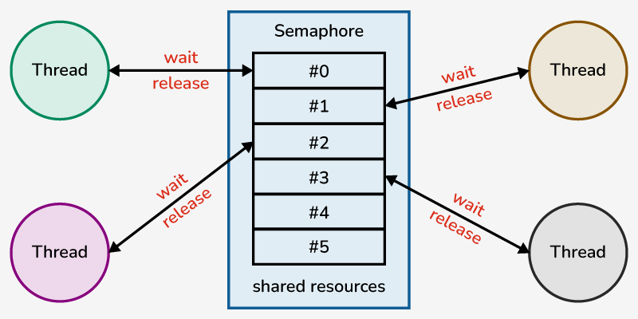
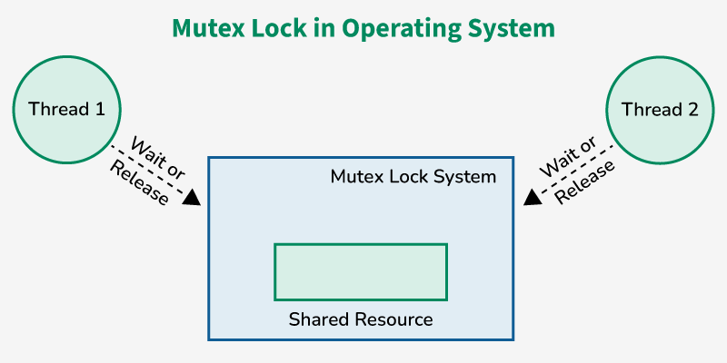

# 세마포어, 뮤텍스, 모니터

##1. 세마포어(Semaphore)
1. 임계 영역에 진입 하기 전에 스위치를 사용 중으로 놓고 임계 영역으로 들어감  
2. 이후에 도착하는 프로세스는 앞의 프로세스 작업 마칠 때까지 기다림    
3. 프로세스 작업 이후 다음 프로세스에게 임계구역을 사용하라는 동기화 신호 보냄

세마포어는 다른 알고리즘과 달리 임계구역이 잠겼는지 직접 점검하거나, busy waiting 하거나, 다른 프로세스에게 동기화 메시지를 보낼 필요 없음

###1-1. 방식
```
Semaphore(n); // 초기 설정, n = 공유 가능한 자원의 수
P(); // 임계 구역 사용중 표시
critical section // 임계 구역
V(); // 임계 구역 비었음 표시
```



###1-2. 특징
- 자원에 접근 가능한 프로세스 수를 카운트 하는 값(세마포어 값)을 가짐
- 소유권 개념이 없어 다른 프로세스/스레드가 해제 가능, 여러 자원에 대한 동시 접근 허용
- **단점 : 교착상태(Deadlock)를 해결하기 어려움, 프로그램 오류 시에 자원 누수, 불일치 발생 가능**
- 데드락 : 교착상태, 두 개 이상의 프로세스가 서로 자원을 기다리며 무한정 대기

##2. 뮤텍스(Mutex)
세마포어 공유 자원이 1일 때를 말함 = 세마포어는 뮤텍스의 특별한 버전
세마포어와 동작 방식이 같음

###2-1. 방식
```
wait(mutex);
critical section;
signal(mutex);
```


###2-1. 특징
- 한 번에 하나의 프로세스나 스레드만 자원에 접근 보장 잠금장치
- 자원 소유권이 있는 프로세스만 잠금을 해제 가능
- **단점 : 프로세스가 임계 구역에서 오래 머물면 다른 프로세스가 기다림, 기아 현상 발생 가능**


##3. 세마포어와 뮤텍스의 차이점
- 동시성 : 세마포어는 여러 프로세스가 동시 접근을 제한적으로 허용하나 뮤텍스는 한번에 하나만
- 소유권 : 뮤텍스는 자원을 잠근 프로세스만 잠금 해제, 세마포어는 다른 프로세스가 해제 가능