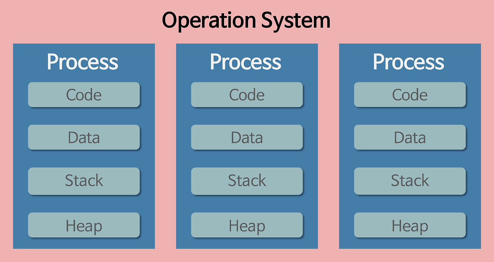
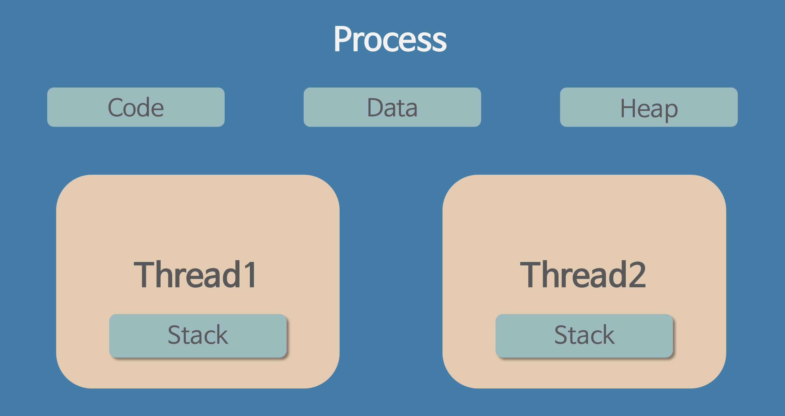

# 운영체제란?

- 사용자가 컴퓨터를 쉽게 다룰 수 있도록 해주는 **인터페이스**
- 한정된 메모리나 시스템 자원을 효율적으로 분배

## 1. 프로세스와 스레드

### 1-1. 프로세스

**Process**란 일반적으로 CPU에서 처리되는 사용자 프로그램, 시스템 프로그램 즉 **실행 중인 프로그램**을 뜻합니다.  
작업(Job), 태스크(Task)라고도 불립니다.

#### 프로세스와 프로그램

- **프로그램**: 하드디스크 등에 저장된 실행 코드를 의미  
- **프로세스**: 프로그램을 구동하여 프로그램 자체와 프로그램 상태가 메모리 상에서 실행되는 작업 단위  
  - 프로그램 자체는 생명이 없고, 보조 기억 장치에 존재하며 실행되기를 기다리는 정적 데이터 묶음  
  - 프로그램의 명령어와 정적 데이터가 자원을 할당받아 메모리에 적재되면 프로세스가 됩니다.

### 1-2. 프로세스의 특징

프로세스는 각각 독립된 영역을 할당받습니다.

#### Code(Text) 영역
- 실행 명령을 포함하는 코드
- 프로그램 시작 시 컴파일한 기계어 코드가 저장
- **읽기 전용 영역**으로, 변경 시 오류 발생

#### Data 영역
- 프로그램 실행 시 생성되고, 종료 시 시스템에 반환
- 전역 변수, 정적 변수, 배열, 구조체 등이 저장
- Data(GVAR) 영역과 BSS 영역으로 나뉩니다:
  - **GVAR**: 초기화된 데이터
  - **BSS**: 초기화되지 않은 데이터

#### Heap 영역
- 메모리를 **동적으로 할당**할 때 사용하는 메모리 영역

#### Stack 영역
- 프로그램이 **자동으로 사용하는 메모리** 영역
- 함수 호출과 관련된 **지역 변수, 매개변수**가 저장
- 함수 호출 시 생성되고, 함수 종료 시 반환

### 1-3. 스레드

**Thread**란 프로그램 내에서, 특히 프로세스 내에서 실행되는 **흐름의 단위**를 의미합니다.

### 1-4. 스레드의 특징

- 스레드는 **프로세스 내에서 Stack, PC 레지스터만 따로 할당**
- **Code, Data, Heap**은 공유
- 프로세스 내 여러 스레드들은 같은 공간과 자원(예: heap 공간)을 공유하며 실행  
  반면, 프로세스끼리는 서로의 메모리에 **직접 접근 불가**
- 메모리 공간이 독립적 -> 독립적 함수 호출, 독립적 실행 흐름
