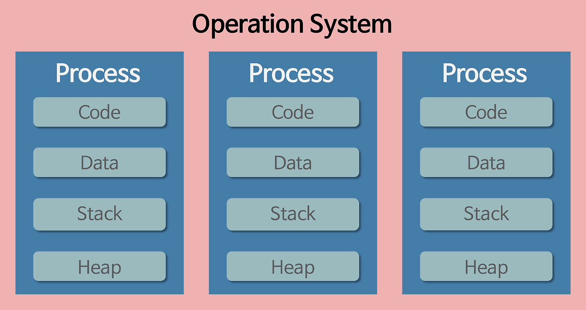

#운영체제란?     

- 사용자가 컴퓨터를 쉽게 다룰 수 있도록 해주는 인터페이스
- 한정된 메모리나 시스템 자원을 효율적으로 분배

#1. 프로세스와 스레드
##1-1. 프로세스
Process 란 일반적으로 CPU 에서 처리되는 사용자 프로그램, 시스템 프로그램 즉 **실행중인 프로그램**을 뜻함      
작업(Job), 태스크(Task) 라고도 불림
###프로세스와 프로그램
프로그램은 일반적으로 하드디스크 등에 저장된 실행코드를 뜻함   
프로세스는 프로그램을 구동하여 프로그램 자체와 프로그램 상태가 메모리 상에서 실행되는 작업 단위   
프로그램 자체는 생명이 없음, 보조 기억장치에 존재해 실행되기를 기다리는 정적 데이터 묶음  
프로그램의 명령어와 정적 데이터가 자원을 할당 받고 메모리에 적재되면 프로세스가 됨
##1-2. 프로세스의 특징

프로세스는 각각 독립된 영역을 할당 받음
- ###Code(Text) 영역
    - 실행 명령을 포함하는 코드들
    - 프로그램 시작 시 컴파일한 프로그램어(기계어)가 저장되어 있음
    - 읽기 전용 영역이므로 프로세스가 함부로 변경 X, 변경 시 오류 발생
- ###Data 영역
    - 프로그램이 실행 될 때 생성, 프로그램 종료될 때 시스템에 반환
    - 전역변수, 정적변수, 배열, 구조체 등 저장
    - Data(GVAR) 영역과 BSS 영역으로 나뉨
        - GVAR : 초기화된 데이터
        - BSS : 초기화 되지 않은 데이터
- ###Heap 영역
    - 메모리를 동적으로 할당할 때 사용하는 메모리 영역
- ###Stack 영역
    - 프로그램이 자동으로 사용하는 메모리 영역
    - 함수 호출과 관계되는 지역변수, 매개변수 저장
    - 함수 호출시 생성, 함수 끝나면 반환

##1-3. 스레드
Thread 란 어떤 프로그램 내에서, 특히 프로세스 내에서 실행되는 흐름의 단위
##1-4. 스레드의 특징

- 스레드는 프로세스 내에서 각각 Stack만 따로 할당
- Code, Data, Heap 은 공유
- 스레드는 한 프로세스 내에서 동작되는 여러 실행의 흐름, 프로세스 내의 공간, 자원들(heap 공간 등)을
  같은 프로세스 내에 스레드끼리 공유하면서 실행
- 같은 프로세스 안에 있는 여러 스레드들은 heap 공간을 공유, 
  반면 프로세스들은 다른 프로세스의 메모리에 직접 접근 불가능