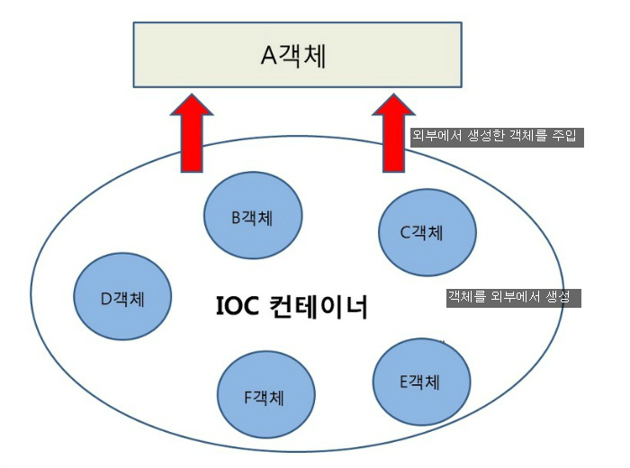

# DI(Dependency Injection)

스프링이 다른 프레임웍과 차별화된 강점으로 **의존 관계 주입** 기능     
객체를 직접 생성하는 것이 아닌, **외부에서 생성한 후 주입해주는 방식**  
DI를 통해서 **모듈 간의 결합도가 낮아지며, 유연성이 높아짐**

# IoC(Inversion of Control)

**제어의 역전**, 제어의 흐름을 바꿈  
메소드나 객체의 호출 작업을 개발자가 정하는 것이 아닌, 외부에서 결정되는 것
의존성을 역전 시켜 **객체 간의 결합도를 줄이고**, 유연한 코드를 작성함  
가독성 및 코드 중복, 유지 보수를 편하게 할 수 있음      

## 기존
1. 객체 생성
2. 의존성 객체 생성(클래스 내부에서 생성)
3. 의존성 객체 메소드 호출

## 스프링 방식
1. 객체 생성
2. 의존성 객체 주입(스스로 만드는 것이 아닌, 제어권을 스프링에게 위임해 스프링이 만들어놓은 것을 주입)
3. 의존성 객체 메소드 호출

## 정리
스프링이 모든 의존성 객체를 스피링이 실행될 때 다 만들어주고 필요한 곳에 주입    
이러한 **의존성 객체들을 Bean이라고 부르며 싱글톤 패턴 특징**을 가짐
